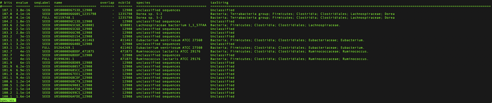
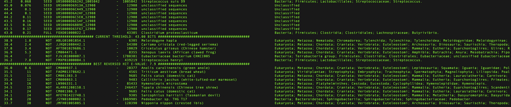
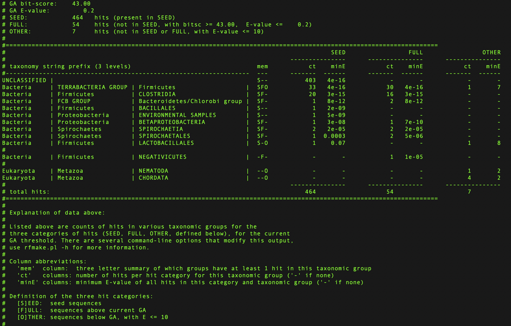

Choosing gathering threshold
============================

The :ref:`glossary:Gathering cutoff` (also known as gathering threshold) corresponds to the bit score of the lowest-scoring sequence that is considered part of the family. When creating families using the :ref:`rfam-cloud:Rfam cloud pipeline`, it is important to choose an accurate cutoff value by **reviewing the following 3 files**: ``species``, ``taxinfo``, and ``align``, as well as the :ref:`glossary:R-scape` secondary structure diagrams.

.. contents:: Table of contents
  :local:

Species file
------------

The rfsearch program produces a file called ``species`` that contains a list of all sequences identified by an Infernal search in the :ref:`glossary:Rfamseq` database using a covariance model based on the :ref:`glossary:Seed alignment`.

1. View the ``species`` file using ``less``::

    less -S species

  The ``-S`` option displays long lines without wrapping them.

  .. hint::
    For help with using ``less``, check out `10 Tips for Effective Navigation <https://www.thegeekstuff.com/2010/02/unix-less-command-10-tips-for-effective-navigation>`_ or type ``man less``.

  Each line corresponds to a sequence matching the covariance model and includes the bit score, sequence label, species, taxonomic lineage, and other information.

      Example species file

2. Find the current gathering cutoff by searching for the word ``THRESHOLD`` using ``less``::

    / THRESHOLD

      Example species file showing current gathering threshold and the best reversed hit

Consider the following questions:

- **How many sequences are above the gathering threshold?** If there are no or very few sequences, then the threshold may need to be lowered.

- **Do you notice any jumps in gathering threshold values?** For example, consider the following list of bit scores:

  - 80.1
  - 79.4
  - 75.4
  - 70.1
  - 69.4
  - 41.1
  - 39.3
  - #### CURRENT THRESHOLD ####
  - 39.2
  - 39.1

  Notice that there is a sudden drop in bit scores between 69.4 and 41.1 bits. You should carefully examine the sequences immediately before and after the drop and decide whether they belong in the same family. A bit score jump could be an indication of where to put the bit score cutoff (in this example, it could be set at 69.4). Please note that a bit score jump alone does not provide enough evidence for setting gathering cutoff for a family and should be used in combination with other information as explained below.

- **Does the taxonomic distribution of the hits match the expectation?** For example, if you are building an RNA family that is described in the literature as bacterial, it is desirable to set the threshold in a way that excludes non-bacterial hits. Each case should be reviewed individually, as it is possible that the unexpected hits could represent contamination, horizontal gene transfer, or a biologically interesting case.

- **Are any SEED sequences below the gathering threshold?**

  The gathering threshold should include all sequences in the SEED file. It is expected that the covariance model will identify all sequences from the seed alignment that the covariance model is based on.

  The **sequence label** (third column) contains 3 possible values:

  .. list-table::

      * - ``SEED``
        - Sequence from the Seed alignment.
      * - ``FULL``
        - Sequence from Rfamseq that was identified using the covariance model.
      * - ``NOT``
        - Any sequence scoring below the gathering threshold.

  If a seed sequence has a very low bit score (for example, lower than the REVERSED score), consider removing it from the seed alignment.

3. Find the top scoring random hit by searching for the word ``REVERSED`` using ``less``::

    / REVERSED

In order to exclude false positives, the rfsearch command scans a large collection of sequences called the **Reversed database**. It consists of 10% of the Rfamseq sequences that have been reversed to preserve the sequence composition but decrease sequence similarity to real sequences (except for rare cases of `palindromes <https://en.wikipedia.org/wiki/Palindrome>`_).

⚠️ The reversed hits are **random sequences** and **should not be included in the family**.

For example, if the current threshold is 40 bits but the top scoring reversed hit is at 45 bits, it means that the gathering threshold needs to be raised to at least 45 bits.

.. hint::
    Consider also reviewing the ``outlist`` file which is similar to ``species`` but contains slightly different information, such as sequence descriptions as well as the details about whether the hits were truncated or appear on the reverse strand.

Taxinfo file
-------------

The ``taxinfo`` file is created by the rfmake program and includes the taxonomic distribution of the hits listed in the ``species`` file. It can be viewed using less::

    less -S taxinfo

      Example taxinfo file

Reviewing the file allows one to better understand the taxonomic distribution of the family.

Align file
----------

The ``align`` file is created by the rfmake program when executed with the ``-a`` option. The file includes an alignment of all the hits listed in the ``species`` file to the covariance model. It can be viewed using ``less``::

    less -S align

It is useful to review the bottom of the alignment as it contains the lowest scoring hits. Ask yourself if the alignment has too many gaps or very large insertions. Are there any sequences that could be excluded by raising the gathering cutoff that would decrease the number of gaps?

⚠️ Do not edit the ``align`` file because it is overwritten every time ``rfsearch.pl -a`` runs - you should edit the SEED alignment instead.

R-scape secondary structures
----------------------------

:ref:`glossary:R-scape` analyses RNA multiple sequence alignment to check if the consensus secondary structure is supported by the covariation observed in the alignment. To run R-scape, enter the following commands::

    mkdir rscape-seed
    R-scape --cyk --outdir rscape-seed SEED
    mkdir rscape-align
    R-scape --cyk --outdir rscape-align align

The results will appear in the ``rscape-seed`` folder that can be copied to your computer for inspection. A good family will have multiple basepairs highlighted in green, which indicates covariation support. The ``--cyk`` option checks if there is an alternative secondary structure compatible with the alignment. Comparing the regular and the ``--cyk`` secondary structure diagrams may suggest a better structure than the current secondary structure consensus found in the seed alignment.

.. figure:: https://www.ncbi.nlm.nih.gov/pmc/articles/PMC5753348/bin/gkx1038fig5.jpg
    :alt: R-scape visualisation of SAM riboswitch
    :width: 600
    :align: center

    R-scape visualisation of SAM riboswitch
