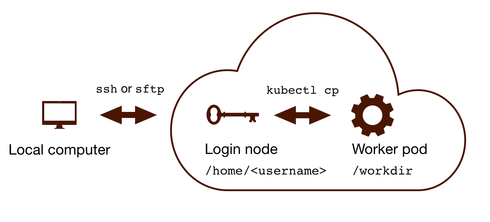

Rfam Cloud pipeline
===================

The Rfam Cloud environment provides access to the command-line interface for curating Rfam families. It uses the same software and the sequence database as the ones used by the Rfam team. The pipeline allows one to create a new RNA family or update an existing Rfam entry.

.. contents::
  :local:

Background
----------

The main Rfam family building pipeline is located on the `EMBL-EBI <https://www.ebi.ac.uk/>`_ computational cluster, so that only the EBI account holders can access it. In order to enable more users to contribute to Rfam, a new version of the pipeline was developed using a `cloud infrastructure <https://www.embassycloud.org/>`_ so that the EBI accounts are not needed. All families built using the cloud pipeline are **reviewed** by the :ref:`rfam-team:Rfam team` before the families are added to Rfam.

Requirements
------------

1. A computer with internet access (Mac, Linux, or PC)
2. A command line environment supporting ``ssh`` (for example, bash)
3. An Rfam Cloud account

Requesting an Rfam Cloud account
--------------------------------

Please :ref:`contact-us:Contact us` to request access to the Rfam family building pipeline. If you intend to use the pipeline for teaching purposes, please let us know in advance to ensure that the pipeline can support the workload.

Connecting to Rfam Cloud
------------------------

Use the username and password provided by the Rfam team to ``ssh`` to Rfam Cloud::

  ssh <username>@cloud.rfam.org

To get access to an interactive session and start using the pipeline run the following command::

  rfcloud --start

You should see a command line prompt:

.. figure:: images/rfam-cloud-cli.png
      :alt: Rfam Cloud command line prompt
      :width: 600
      :align: center

      Rfam Cloud command line prompt

To verify that the system works, try calling the ``rfsearch`` and ``rfmake`` scripts (you should see help messages explaining how to use the scripts)::

  rfsearch.pl -h
  rfmake.pl -h

.. TIP::
  .. image:: https://cdn.brandfolder.io/5H442O3W/as/pl546j-7le8zk-5guop3/Slack_RGB.png
     :target: https://join.slack.com/t/rfam-cloud/shared_invite/zt-cp6xxpur-HtwEnAxuK6RhhyTu7c8hGA
     :width: 100
  `Join Rfam Cloud on Slack <https://join.slack.com/t/rfam-cloud/shared_invite/zt-cp6xxpur-HtwEnAxuK6RhhyTu7c8hGA>`_ to get help with the pipeline from the Rfam team

10 steps for building an Rfam family
------------------------------------

✏️ Interested in editing an Rfam family? Skip to :ref:`rfam-cloud:Updating an existing Rfam family`.

1. Create a new folder
^^^^^^^^^^^^^^^^^^^^^^

📂 Create a new folder, for example *rfam_test* and navigate to it::

  mkdir rfam_test
  cd rfam_test

2. Prepare a SEED file
^^^^^^^^^^^^^^^^^^^^^^

Each family has a :ref:`glossary:seed alignment` file called ``SEED`` that contains a multiple sequence alignment of the confirmed instances of a family. To get started, you will need a :ref:`glossary:Stockholm format` file with at least 1 RNA sequence and a consensus secondary structure, for example see the `tRNA seed alignment <https://xfamsvn.ebi.ac.uk/svn/data_repos/trunk/Families/RF00005/SEED>`_.

If you have a `FASTA <https://en.wikipedia.org/wiki/FASTA_format>`_ file called ``file.fasta`` with a **single RNA sequence**, convert it to Stockholm format and predict a consensus secondary structure using RNAfold (the ``-r`` option)::

  predict_ss.pl -infile <file.fasta> -outfile SEED -r

Alternatively, create a ``SEED`` file using the `vi <https://www.cs.colostate.edu/helpdocs/vi.html>`_ or `nano <https://www.howtoforge.com/linux-nano-command/>`_ text editors and paste the file contents from your local computer. See :ref:`rfam-cloud:Copying files to and from Rfam Cloud` for instructions about moving files to and from Rfam Cloud.

It is recommended that the sequences are named in the ``accession:start-end`` format where ``accession`` is an `ENA <http://www.ebi.ac.uk/ena/>`_, `GenBank <https://www.ncbi.nlm.nih.gov/genbank/>`_, or `RNAcentral <https://rnacentral.org>`_ identifier, and ``start-end`` are the coordinates of the RNA in the accession (for example, ``AB003409.1/96-167``). See the `tRNA seed alignment <https://xfamsvn.ebi.ac.uk/svn/data_repos/trunk/Families/RF00005/SEED>`_ for more examples. ⚠️ The sequence name cannot contain the parenthesis characters (``(`` and ``)``).

Once you have a Stockholm file called ``SEED`` in your working directory, proceed to the next step.

3. Find similar sequences using rfsearch
^^^^^^^^^^^^^^^^^^^^^^^^^^^^^^^^^^^^^^^^

Build and calibrate a :ref:`glossary:Covariance model (CM)` based on your seed alignment and search for similar sequences in the :ref:`glossary:rfamseq` database::

  rfsearch.pl -nodesc -relax -t 25

.. list-table::

    * - Option
      - Meaning
    * - ``-nodesc``
      - creates a required file called ``DESC`` that contains the description of the family. You only need to use the ``-nodesc`` flag the first time you run rfsearch, after that you will get an error if you use ``-nodesc`` because a ``DESC`` file already exists.
    * - ``-relax``
      - allow sequences not found in the :ref:`glossary:rfamseq` database to be included in the seed alignment (recommended)
    * - ``-t 30``
      - :ref:`glossary:Gathering cutoff` in bits. Usually 30 bits is a good starting point as most families are expected to have a threshold higher than 30.

⚠️ **This step can take a long time** (up to 10 minutes or longer) depending on the size of the alignment and the availability of computational resources.

4. Choose a gathering threshold
^^^^^^^^^^^^^^^^^^^^^^^^^^^^^^^

The output files (:ref:`choosing-gathering-threshold:Species file` and :ref:`choosing-gathering-threshold:Outlist file`) can be used to determine the gathering threshold for this family (the bit score of the last true positive hit).

.. NOTE::
  For detailed instructions on how to select the threshold, see :ref:`choosing-gathering-threshold:Choosing gathering threshold`.

5. Add sequences to SEED (optional)
^^^^^^^^^^^^^^^^^^^^^^^^^^^^^^^^^^^

The :ref:`glossary:seed alignment` needs to represent the taxonomic diversity and the structural features observed in different instances of the family. A seed alignment needs to have **at least 2 sequences** but a larger seed alignment is preferred.

Find an accession in the ``outlist`` file that you would like to add to the ``SEED`` (for example, ``AB480043.1``)::

  grep AB480043.1 outlist >> addme
  rfseed.pl addme

To remove sequences from ``SEED`` (if added in error, for example), create a file with a list of accessions you want to remove using ``grep`` as described above and call it *removeme*. Make sure the accession is exactly the same as in the ``SEED`` file, for example ``NW_002196667.1/1438869-1438941``. Then run the following command::

  rfseed.pl -d -n <removeme>

Consider **manually editing the alignment** on your local computer using `RALEE <http://sgjlab.org/ralee/>`_ or `belvu <http://sonnhammer.sbc.su.se/Belvu.html>`_ and re-uploading it as explained in **Step 1**.

6. Repeat rfsearch with a new threshold
^^^^^^^^^^^^^^^^^^^^^^^^^^^^^^^^^^^^^^^

🔄 Steps 3 to 6 should be repeated until the seed alignment can no longer be improved::

  rfsearch.pl -t <new_cutoff> -relax -ignoresm

The ``-ignoresm`` option overrides the threshold set at the previous iteration and saved in the ``DESC`` file.

This process is known as **iteration** (see :ref:`building-families:Expanding the seed (iteration)` for more information).

7. Create required family files with rfmake
^^^^^^^^^^^^^^^^^^^^^^^^^^^^^^^^^^^^^^^^^^^

Once the cutoff has been chosen, all the required family files can be generated like this::

  rfmake.pl -t <gathering_cutoff> -a

The ``-a`` option creates an ``align`` file with an alignment of all the sequences above the gathering threshold. For more information about setting the ``-t`` parameter, see :ref:`choosing-gathering-threshold:Choosing gathering threshold`.

After running rfmake you should:

- review the :ref:`choosing-gathering-threshold:Align file` to check that the threshold is set correctly.
- review the :ref:`choosing-gathering-threshold:Taxinfo file` to check that the taxonomic distribution of the family is correct.

Any unwanted sequences can be excluded by rerunning rfmake with a higher threshold ``-t``.

8. Add metadata to the DESC file
^^^^^^^^^^^^^^^^^^^^^^^^^^^^^^^^

Each family is described using in a ``DESC`` file (see the `tRNA DESC file <https://xfamsvn.ebi.ac.uk/svn/data_repos/trunk/Families/RF00005/DESC>`_ as an example). The following fields are required:

:ID:
    a unique ID, such as *tRNA* or *skipping-rope*. No spaces are allowed.
:DE:
  | a short description of the family.
  | Example: ``DE   GlmZ RNA activator of glmS mRNA``
  | ⚠️ Maximum **75 characters**.

:AU:
    Author name with an `ORCID <https://orcid.org/>`_ id. Multiple ``AU`` lines can be used.
    Example: ``AU   Eddy SR; 0000-0001-6676-4706``
:SE:
    Seed alignment source. Example: ``SE   Published; PMID:21994249;``
:SS:
    Secondary structure source.
    Examples:

    - ``SS   Published; PMID:28977401;``
    - ``SS   Predicted; mfold;``

:TP:
    One of Rfam `RNA types <https://rfam.readthedocs.io/en/latest/searching-rfam.html#search-by-entry-type>`_.
    Example: `TP   Gene; sRNA;`
:DR:
    A reference to a `Gene Ontology <http://geneontology.org/>`_ or `Sequence Ontology <http://sequenceontology.org/>`_ term. Multiple ``DR`` lines can be used. Example:

    - ``DR   SO; 0000253; tRNA;``
    - ``DR   GO; 0030533; triplet codon-amino acid adaptor activity;``

    You may find the `QuickGO <https://www.ebi.ac.uk/QuickGO/>`_ website useful for finding GO terms.
    A link to a website can also be included, for example: ``DR   URL; http://telomerase.asu.edu/;``
:CC:
    A free text comment describing what is known about the RNA (function, taxonomic distribution, experimental validation etc).
    ⚠️ Maximum **80 characters per line**, but multiple ``CC`` lines can be used.
:WK:
    A `Wikipedia <https://en.wikipedia.org/>`_ link (you should create a new Wikipedia article or link to an existing one).
    Example: ``WK   Transfer_RNA``

📚 To add literature references, use the following command that automatically imports information from `PubMed <https://www.ncbi.nlm.nih.gov/pubmed/>`_::

  add_ref.pl <pubmed_id>

⚠️ The ``GA``, ``TC``, ``NC``, ``BM``, ``CV``, ``SM`` lines are added automatically, please do not change them manually. The ``RN``, ``RM``, ``RT``, ``RA``, and ``RL`` lines are added by the ``add_ref.pl`` script. The ``AC`` field is assigned once the family is stored in the official Rfam database.

9. Perform quality control checks
^^^^^^^^^^^^^^^^^^^^^^^^^^^^^^^^^

The ``rqc-all`` script performs multiple quality controls on the family. It checks the file formats, the accessions, and the ``DESC`` file::

  cd .. && rqc-all.pl rfam_test

10. Send SEED and DESC files for review
^^^^^^^^^^^^^^^^^^^^^^^^^^^^^^^^^^^^^^^

Download your ``SEED`` and ``DESC`` files to your local machine and send the files to the Rfam team for review by email or Slack. 🎉🎉🎉

See :ref:`rfam-cloud:Copying files to and from Rfam Cloud` for instructions about moving files to and from Rfam Cloud.

.. DANGER::
  We encourage you to **always keep a local copy of the important data**!

Updating an existing Rfam family
--------------------------------

The only difference between creating a new family and updating an existing one is that the ``SEED`` and ``DESC`` files are retrieved from Rfam::

  rfco.pl <RF0XXXX>
  cd <RF0XXXX>

After that, follow the family building instructions: :ref:`rfam-cloud:3. Find similar sequences using rfsearch`.

Copying files to and from Rfam Cloud
------------------------------------

The Rfam Cloud consists of a **login node** that handles the account login and **worker pods** which control the Rfam family building pipeline. When you run ``ssh <username>@cloud.rfam.org`` you are connected directly to your worker pod.

The login node and the worker pods currently have **different filesystems** which means that if you are on the worker pod you cannot see the files on the login node and vice versa. You can move files to and from login node using ``scp`` or ``sftp`` but then you need to use ``kubectl cp`` to make the files available on the worker pods.

🛠️ Work on unifying the two filesystems is underway which should make moving files to and from Rfam more user-friendly.

Copying files to Rfam Cloud
^^^^^^^^^^^^^^^^^^^^^^^^^^^

🖥️ On your **local machine**::

  scp SEED <username>@cloud.rfam.org:/home/<username>

This copies a file ``SEED`` to your login node. You can also use an `SFTP <https://en.wikipedia.org/wiki/SSH_File_Transfer_Protocol>`_ client for this task (for example, `CyberDuck <https://cyberduck.io>`_ on Mac and Windows).

⚙️ On **worker pod**::

  ssh <username>@cloud.rfam.org
  kubectl get pod --selector=user=<username>,tier=frontend

Record the ``pod_id`` that looks like *rfam-login-pod-<username>-6b9f46fc76-67fhn*, then exit to the login node::

  exit

🗝️ On **login node**::

  kubectl cp SEED <pod_id>:/workdir

Then get back to the worker pod::

  kubectl exec -it <pod_id> bash

The file should appear in your ``workdir`` folder. You can specify other paths in the ``kubectl cp`` command to move the files to any subfolder.

Copying files from Rfam Cloud
^^^^^^^^^^^^^^^^^^^^^^^^^^^^^

⚙️ On **worker pod**::

  ssh <username>@cloud.rfam.org
  kubectl get pod --selector=user=<username>,tier=frontend

Record the ``pod_id`` that looks like *rfam-login-pod-<username>-6b9f46fc76-67fhn*, then exit to the login node::

  exit

🗝️ On **login node**::

  kubectl cp <pod_id>:/workdir/SEED .

🖥️ On your **local machine**::

  scp <username>@cloud.rfam.org:/home/<username>/SEED .

Tips and tricks
---------------

- Filter out redundant sequences. For example, to remove redundancy from a file called `align` using 95% identify as a cutoff run::

    esl-weight -f --idf 0.95 align

- Iteratively re-align seed sequences to the CM::

    cmbuild --refine SEED.new CM.new SEED

Questions or comments?
----------------------

:ref:`contact-us:Contact us` by email, `raise an issue <https://github.com/Rfam/rfam-family-pipeline/issues>`_ on GitHub, or get in touch on Slack.
