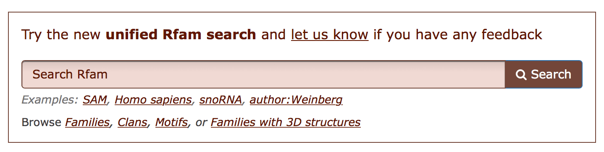

Searching Rfam
==============

In addition to the quick links on the home page, every page in the Rfam
site includes a `Search <http://rfam.org/search>`_ link in the page header, which you can use to
access all of the search methods that we offer:

.. contents::
  :local:

Additionally, every page in the Rfam site includes a `Browse <http://rfam.org/browse>`_ link in
the page header, which you can use to explore Rfam
`families <http://rfam.org/families>`_,
`clans <http://rfam.org/clans>`_,
and `motifs <http://rfam.org/motifs>`_.

`:new:` For more examples please see our newly published `Current Protocols in Bioinformatics <https://currentprotocols.onlinelibrary.wiley.com/doi/full/10.1002/cpbi.51>`_. 

Unified text search
--------------

The new text search, available on the `Rfam homepage <http://rfam.org>`_
or at the top of any Rfam page, will soon replace older search options, such as
*Keyword search*, *Taxonomy search*, *browsing* entries by type, and *Jump To* navigation.

Using the new search one can:

* explore Rfam by category using **facets**
* **sort** results
* **bookmark and share** search URLs

**Examples**:

* `families <http://rfam.org/search?q=entry_type:%22family%22>`_,
* `clans <http://rfam.org/search?q=entry_type:%22clan%22>`_,
* `motifs <http://rfam.org/search?q=entry_type:%22motif%22>`_,
* `families with 3D structures <http://rfam.org/search?q=entry_type:%22Family%22%20AND%20has_3d_structure:%22Yes%22>`_
* `snoRNA families that match human sequences <http://rfam.org/search?q=rna_type:%22snoRNA%22%20AND%20TAXONOMY:%229606%22>`_

The new search is a **full replacement** for most of the old search functionality except
for taxonomy as the new search can currently find only species but not higher taxa
(for example, one can search for *Homo sapiens* but not *Mammals*). Stay tuned for
future updates and use the old Taxonomy search in the meantime.

Text search API
^^^^^^^^^^^^^^^

Text search is powered by the `EBI search <http://www.ebi.ac.uk/ebisearch/overview.ebi>`_
which supports a `REST API <http://www.ebi.ac.uk/ebisearch/documentation.ebi>`_
that can be used to access the Rfam data programmatically in addition to the :ref:`Rfam API`.

Here is an example query that retrieves riboswitch families as well as their descriptions
and the number of sequences in seed alignments:

.. code-block:: url

    https://www.ebi.ac.uk/ebisearch/ws/rest/rfam?query=riboswitch&format=json&fields=num_seed,description

Here is `full list of fields <http://www.ebi.ac.uk/ebisearch/metadata.ebi?db=rfam>`_ that can be retrieved
using the text search API.

-------------------------

Sequence search
---------------

Searching a nucleotide sequence (DNA or RNA) against the Rfam library
of covariance models will identify any regions in your sequence we
would classify as belonging to one our RNA families.

Single sequence search
^^^^^^^^^^^^^^^^^^^^^^

If your sequence is in the EMBL release on which *rfamseq* is based, your
sequence will already be searched and annotated. You can use the
Genbank/EMBL accession in a "look up sequence box" on the sequence
search page or a "jump to" box. Simply paste the accession into
the box.

.. HINT::
  The accession version number is not required

You can find out which version of EMBL we are currently using in the
release `README file <ftp://ftp.ebi.ac.uk/pub/databases/Rfam/CURRENT/README>`_
on our FTP site.

Medium scale batch searches (less than 1,000 sequences)
^^^^^^^^^^^^^^^^^^^^^^^^^^^^^^^^^^^^^^^^^^^^^^^^^^^^^^^

If you have multiple nucleotide sequences to search, you can use our
batch upload facility to upload a file of your sequences in FASTA
format. Information on the format for this file can be found under the
more link `here <http://rfam.org/search>`_. We will
search your sequences against the Rfam library of covariance models and email the results
back to you, usually within 48 hours. We request that you search a
maximum of 1000 sequences in each file. Each sequence may be up to 200kb
in length.

Large scale batch searches (more than 1,000 sequences)
^^^^^^^^^^^^^^^^^^^^^^^^^^^^^^^^^^^^^^^^^^^^^^^^^^^^^^

If you have a large number of nucleotide searches, it may be more
convenient to run Infernal searches locally (see section :ref:`Genome annotation`).

-------------------------

Other ways to search Rfam
------------------------

Keyword search
^^^^^^^^^^^^^^

.. WARNING::

  The old keyword search will soon be replaced by the Unified text search.

Each page in the Rfam site contains a keyword search box in the
header. This is the broadest text search we offer and you can use
this to find all Rfam families that match a particular keyword. The
search will try to match your query term against textual information from
several different sections of the Rfam database:

* text fields for Rfam families, such as family descriptions and identifiers
* Rfam associated Wikipedia entries
* literature reference titles and authors
* PDB structures

Your keyword should be a simple text string (letters and numbers),
but underscores, hyphens, periods and spaces are also
accepted. Wildcard terms are not necessary, since the search system will
add wildcards to the end of your search terms. If in doubt, use the
shortest text string you can and you will receive the widest set of
possible matches. You can then sort the results and refine your search
if needed.

Do remember that the keyword search tries to match against all
of the sections of the database, including the Wikipedia article, so if
your term is mentioned in the family description text, you will also
get a match.

If you search with two terms at once your will only receive a result if
a match is found for both terms.

**Search results page**

Your query term is reported and, if the term you used exactly
matched a family ID or accession, this is also reported. This text is
followed by a small table that provides a summary showing in which
section of the database your query string was found.

The larger table that follows provides links to the
families that have a match to your query in at least one section of
the database. Each matching family is listed only once, though it may
have matches in more than one section of the database. For each
family with a match we report:

* accession (linked to the the family page)
* identifier (linked to the family page)
* family description line
* between one and four columns that specify in which of the sections
  of the database the match was found

If your query term does not match any data in the database,
you will be taken to a 'no results' page which will offer you tips on
how to refine your search.

-------------------------------------

Search by entry type
^^^^^^^^^^^^^^^^^^^^

.. WARNING::

  Entry type search will soon be replaced by the Unified text search.

You can `search by entry type <http://rfam.org/search#tabview=tab4>`_
to view or download a list of families by type.

Here is a list of Rfam ncRNA types:

* Cis-reg;

  * Cis-reg; IRES;
  * Cis-reg; frameshift_element;
  * Cis-reg; leader;
  * Cis-reg; riboswitch;
  * Cis-reg; thermoregulator;

* Gene;

  * Gene; CRISPR;
  * Gene; antisense;
  * Gene; miRNA;
  * Gene; rRNA;
  * Gene; ribozyme;
  * Gene; sRNA;
  * Gene; snRNA;
  * Gene; snRNA; snoRNA; CD-box;
  * Gene; snRNA; snoRNA; HACA-box;
  * Gene; snRNA; snoRNA; scaRNA;
  * Gene; snRNA; splicing;
  * Gene; tRNA;

* Intron;

.. TIP::

  If you would like to download results as text, click **Show the unformatted list**
  at the bottom of the `search results page <http://rfam.org/search#tabview=tab4>`_.

-----------------------------

Taxonomy search
^^^^^^^^^^^^^^^

.. WARNING::

  Taxonomy seach search will soon be replaced by the Unified text search.

This is one of the more interesting and powerful ways to search Rfam.
Using the taxonomy search form, you can identify families
that are specific to a given taxonomic level or those found in a given
set of  taxonomic levels. You can also limit your queries to those
families which are found only in a single species or taxonomic
level. Please read the information under the "More..." link on the
`taxonomy search page <http://rfam.org/search#tabview=tab3>`_
for details on how to use this search.

-----------------------------

Exploring families by name
^^^^^^^^^^^^^^^^^^^^^^^^^^

The `Browse <http://rfam.org/browse>`_ link at the top of each page will take you to an
index page, from which you can browse all Rfam families by
their family names (otherwise known as the Rfam IDs). These are the
familiar names for the RNA, such as "tRNA" or
"Hammerhead_1". The families are organised alphabetically and you can
use the ranges (A-F, G-L etc) to take you to the appropriate place in
the list. Families where the name begins with a number (e.g. "6S", "7SK")
can be found under the 0-9 index.

-----------------------------------

"Jump to" search
^^^^^^^^^^^^^^^^

.. WARNING::

  "Jump to" search will soon be replaced by the Unified text search.

Many pages in the site include a small search box, entitled
"Jump to...". The "Jump to..." box allows you to go immediately to the
page for any entry in the Rfam site. This is primarily useful when you
know the family or the sequence accession you are interested in.

The "Jump to..." search understands Genbank/EMBL accessions,
Rfam family accessions and identifiers for most types of entry.
For example, to find a particular family, you can enter either an Rfam
family accession, e.g. **RF00198**, or, if you find it
easier to remember, a family ID, such as **SL1**. This will
take you to the main entry for this family.  Note that the search is
case insensitive. Searches for family identifiers such as 'RNase' or
'mrp' will be too ambiguous and you will get an error "Couldn't guess
entry". In this case you need to specify the the full family name,
e.g. RNase_mrp'. If you want to search with an ambiguous family
identifier use the keyword search instead.

Alternatively, if you are interested in the annotations to a
particular sequence or genome you can use the Genbank/EMBL accession,
e.g. **AE017225** and you will be taken to a list of the
relevant Rfam family annotations to this sequence. This also works for
EMBL CON files, e.g. **CM000428**.

The order in which the search tries to match your query term
against the various types of ID and accession in the database is:

* Rfam accession, e.g. **RF00198**
* Rfam identifier, e.g. **SL1**
* Genome Genbank/EMBL accession, e.g. **AE017225**
* Sequence Genbank/EMBL accession e.g. **AF325543**

If all of the guesses fail, you'll see an error
message saying "Entry not found".
